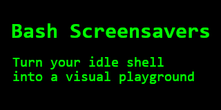

# Bash Screensavers



Tired of your boring old terminal?
Wish you could spice up your command line with some animated ASCII art?
Well, you've come to the right place!

Welcome to **Bash Screensavers**,
a collection of screensavers written entirely in `bash`.

Because who needs fancy graphics cards and complex rendering engines
when you have `echo`, `sleep`, and a little bit of `tput` magic?

[Tour the gallery](#tour-the-gallery) -
[Get the party started](#get-the-party-started) -
[Join the Community](#join-the-community) -
[Contributing](./CONTRIBUTING.md)

[](https://github.com/attogram/bash-screensavers/releases)
[](./LICENSE)

[](https://github.com/attogram/bash-screensavers/commits/main/)
[](https://github.com/attogram/bash-screensavers/stargazers)
[](https://github.com/attogram/bash-screensavers/watchers)
[](https://github.com/attogram/bash-screensavers/forks)
[](https://github.com/attogram/bash-screensavers/issues)


## Tour the gallery

For a full list of all screensavers, see the [Gallery README](./gallery/README.md).

### Matrix


### Bouncing


### Rain


### Tunnel


## Get the party started

```bash
git clone https://github.com/attogram/bash-screensavers.git
cd bash-screensavers
./screensaver.sh
```
```
Bash Screensavers v0.0.21 (Mystic Jazz)

  1 . alpha        - random colorful pixels
  2 . bouncing     - bouncing 'O' madness
  3 . cutesaver    - infinite loop of cuteness
  4 . fireworks    - Ooh! Aah! Pretty lights!
  5 . life         - cellular automata
  6 . matrix       - the matrix has you
  7 . pipes        - an endless pipe maze
  8 . rain         - soothing, gentle rain
  9 . speaky       - dramatic talking screensaver
  10. stars        - twinkling starfield
  11. tunnel       - fly into the digital tunnel
  12. vibe         - vibe coding

(Press ^C to exit)

Choose your screensaver:
```

## Join the Community

Have questions, ideas, or just want to chat? Join our Discord server!

[**Join our Discord!**](https://discord.gg/BGQJCbYVBa)


## Contributing

We welcome contributions!

Feel free to fork the repo,
create a new screensaver,
fix a bug,
make something better
and submit a pull request.

For more information, please see the [Developers Guide](./CONTRIBUTING.md).

---

## Gallery Tools

This project includes several scripts to help with development and maintenance. For a full list of tools and their usage, please see the [Tools README](./tools/README.md).

---

*Made with ❤️ and a lot of bash.*
