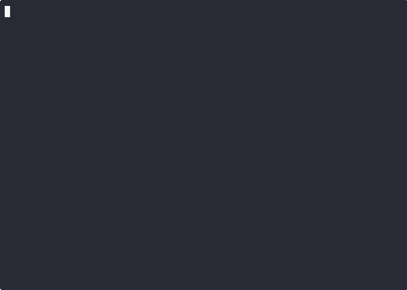

# Bash Screensavers

Tired of your boring old terminal?
Wish you could spice up your command line with some animated ASCII art?
Well, you've come to the right place!

Welcome to **Bash Screensavers**,
a collection of screensavers written entirely in `bash`.

Because who needs fancy graphics cards and complex rendering engines
when you have `echo`, `sleep`, and a little bit of `tput` magic?


## Tour the gallery

### Matrix


### Bouncing


### Rain


### Tunnel


## Get the party started

```bash
git clone https://github.com/attogram/bash-screensavers.git
cd bash-screensavers
./screensaver.sh
```
```
Bash Screensavers v0.0.15 (Mystic Path)

  1 . alpha        - random colorful pixels
  2 . bouncing     - bouncing 'O' madness
  3 . cutesaver    - infinite loop of cuteness
  4 . fireworks    - Ooh! Aah! Pretty lights!
  5 . matrix       - the matrix has you
  6 . pipes        - an endless pipe maze
  7 . rain         - soothing, gentle rain
  8 . speaky       - dramatic talking screensaver
  9 . stars        - twinkling starfield
  10. tunnel       - fly into the digital tunnel
  11. vibe         - vibe coding

(Press ^C to exit)

Choose your screensaver:
```

## Join the Community

Have questions, ideas, or just want to chat? Join our Discord server!

[**Join our Discord!**](https://discord.gg/BGQJCbYVBa)


## Developers Guide

### Contributing

We welcome contributions!

Feel free to fork the repo,
create a new screensaver,
fix a bug,
make something better 
and submit a pull request.

Let's make the command line a more colorful place, one ASCII character at a time.

### Create Your Own Screensaver

Got an idea for a cool ASCII animation? Want to contribute to the collection? It's easy!

#### The Easy Way (Generator)

You can use the built-in generator to create a new screensaver with all the boilerplate code you need. Just run:

```bash
./screensaver.sh --new my-awesome-screensaver
```
(You can also use `-n` instead of `--new`)

This will create a new directory `gallery/my-awesome-screensaver` with a starter `my-awesome-screensaver.sh` script and a `config.sh` file. All you have to do is edit the `.sh` file to add your animation logic!

#### The Hard Way (Manual)

1.  **Create a new directory** for your screensaver inside the `gallery` directory. For example, `gallery/my-awesome-screensaver`.
2.  **Create a shell script** inside your new directory with the same name as the directory, ending in `.sh`. For example, `gallery/my-awesome-screensaver/my-awesome-screensaver.sh`.
3.  **Write your masterpiece!** Your script should:
    - Be executable (`chmod +x your-script.sh`).
    - Handle cleanup gracefully. Use `trap` to catch `SIGINT` (`Ctrl+C`) and restore the terminal to its normal state.
    - Be awesome.

That's it! The main `screensaver.sh` script will automatically detect your new creation.

### Project Overview

* `./screensaver.sh` is the main menu script
    * it shows a list of available screensavers
    * and prompts user to pick one to run.
* `./gallery` is the gallery directory, where all screensavers are stored.
    * Each screensaver has its own directory inside `./gallery`
        * The name of the directory is the name of the screensaver.
        * example: screensaver named 'foo' is in: `./gallery/foo`
    * Each screensaver has a run script in format 'name.sh'
        * example: `./gallery/foo/foo.sh`
    * Each screensaver has a config file with name, tagline, etc
        * example: `./gallery/foo/config.sh`
* `./tests` directory is the BATS test suite for this project
* `./.github` directory is for GitHub Workflows for this project.

### Project Structure

```
.
├─ screensaver.sh    # Where the ASCII magic begins
├─ LICENSE           # MIT Licensed, because all the cool kids are doing it
├─ README.md         # This file, isn't it pretty?
├─ gallery           # Welcome to the Gallery of Terminal Visualizations
│   ├─ name          # I'm a screensaver, and I have my own directory!
│   │   └─ name.sh   # I'm a screensaver, and I can run, run, run!
│   │   └─ config.sh # Psst... want some free metadata?
├─ tests             # I gotta BATSy idea, we should test this stuff
│   └─ tests.sh      # It can't be that bad, can it?
└─ .github           # GitHub magic lives here
    └─ workflows
        └─ create.release.for.tag.yml
```

### Style Suggestions

* Indents **SHOULD** be whatever works for you
* Functions and variables **SHOULD** be in `snake_case`
* Super-duper important variables **SHOULD** be in `SCREAMING_SNAKE_CASE`
* You **MUST** have fun
    * Why use boring function names like `main()`
      when `start_the_visual_pleasure()` is just a few more characters

### Requirements

* Bash v3.2 for `./screensaver.sh`
* Individual screensavers may use any Bash version that makes them happy
* All screensavers must die with honor
  * Gracefully handle `^C` to clean up the terminal and `exit 0`
* All shell scripts must have execute permission: `chmod +x *.sh`

### Codespaces

* whip up a [Codespace from attogram/bash-screensavers](https://codespaces.new/attogram/bash-screensavers) for fun!

---

## Development Tools

### `tools/smile-for-the-camera.sh`

This script is used to generate animated GIF previews for each screensaver. It uses `asciinema` to record a `.cast` file and `agg` to convert it to a `.gif`. The output files are saved in the `gallery/<screensaver_name>/` directory.

**Usage:**
```bash
./tools/smile-for-the-camera.sh
```

---

*Made with ❤️ and a lot of bash.*
