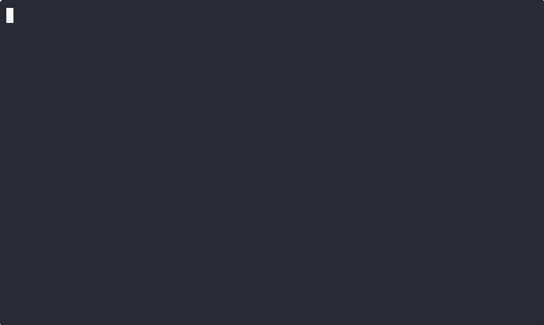

# Gallery

A full list of all screensavers in the gallery.

## alpha

*random colorful pixels*

**Description:** A minimalist screensaver that slowly fills the screen with a random pattern of colorful pixels. Each character block is placed one at a time, creating a mesmerizing and ever-changing mosaic. It's simple, lightweight, and surprisingly hypnotic.

**Authors:** attogram

**License:** MIT

**[View Cast](./alpha/alpha.cast)**

---
## bouncing

*bouncing 'O' madness*

**Description:** A tribute to the DVD screensavers of yesteryear. Watch as multiple 'O's bounce around the terminal, changing color and direction as they hit the edges. Will they ever hit the corner? Only time will tell.

**Authors:** attogram

**License:** MIT

**[View Cast](./bouncing/bouncing.cast)**

---
## cutesaver

*infinite loop of cuteness*

**Description:** Prepare for an onslaught of adorable ASCII art. This screensaver cycles through a collection of cute and charming images, bringing a little bit of joy and whimsy to your terminal. A huge shoutout to the original artists!

**Authors:** kestraI, attogram

**License:** MIT

**[View Cast](./cutesaver/cutesaver.cast)**

---
## fireworks

*Ooh! Aah! Pretty lights!*

**Description:** Light up your terminal with a dazzling fireworks show. Watch as colorful rockets launch and explode into beautiful, shimmering patterns. A celebration for your command line.

**Authors:** attogram

**License:** MIT

**[View Cast](./fireworks/fireworks.cast)**

---
## life

*cellular automata*

**Description:** Conways game of life lives in your terminal

**Authors:** Liam-Wirth, attogram

**License:** Unknown, MIT

**[View Cast](./life/life.cast)**

---
## matrix

*the matrix has you*

**Description:** Enter the Matrix with this digital rain effect. Green characters cascade down your screen, creating the iconic, mesmerizing look from the movies. This version is optimized for performance, so you can really feel like you're in the simulation.

**Authors:** attogram

**License:** MIT

**[View Cast](./matrix/matrix.cast)**

---
## pipes

*an endless pipe maze*

**Description:** Get lost in a labyrinth of colorful, winding pipes. This highly customizable screensaver continuously builds an intricate network of pipes that twist and turn across your terminal. No two runs are ever the same.

**Authors:** Pipeseroni/pipes.sh contributors, Yu-Jie Lin, Matthew Simpson

**License:** MIT

**[View Cast](./pipes/pipes.cast)**

---
## rain

*soothing, gentle rain*

**Description:** Relax and unwind with the calming effect of digital rain. This screensaver simulates a gentle downpour in your terminal, with droplets falling and splashing. It's the perfect way to bring a little bit of tranquility to your workspace.

**Authors:** attogram

**License:** MIT

**[View Cast](./rain/rain.cast)**

---
## speaky

*dramatic talking screensaver*

**Description:** Why just watch when you can listen? This screensaver uses text-to-speech to deliver a monologue of dramatic, humorous, and sometimes existential phrases. Each line is displayed at a random location, with a random voice, for maximum theatrical effect.

**Authors:** Jules

**License:** MIT

**[View Cast](./speaky/speaky.cast)**

---
## stars

*twinkling starfield*

**Description:** Gaze into the cosmos with this starfield simulation. The screensaver generates a field of stars that twinkle and shimmer, creating a peaceful and mesmerizing view of the night sky. Perfect for moments of quiet contemplation.

**Authors:** attogram

**License:** MIT

**[View Cast](./stars/stars.cast)**

---
## tunnel

*fly into the digital tunnel*

**Description:** Prepare for hyperspace! This screensaver creates the effect of flying through a digital tunnel, with concentric shapes expanding towards you. It's a fast-paced and visually engaging experience.

**Authors:** attogram

**License:** MIT

**[View Cast](./tunnel/tunnel.cast)**

---
## vibe

*vibe coding*

**Description:** a simulation of vibe coding

**Authors:** Jules <https://github.com/apps/google-labs-jules>, attogram

**License:** MIT

**[View Cast](./vibe/vibe.cast)**

---
